# Education Video Player: Design Journey

## Project Overview

### Problem Statement

An EdTech company has tasked me with developing a simple web application that allows users to create, comment on, and watch educational videos. The goal is to provide a seamless and engaging user experience while integrating with a predefined API for managing video content and comments.

### Core Functionalities

- Allow users to "log in" using their first and last name.
- Display a list of videos and allow users to select and watch them.
- Allow users to upload new video entries with a title, description, and video URL.
- Enable users to comment on videos and view comments from others.
- Provide full-screen video playback with volume and playback speed controls.
- Ensure a user-friendly and visually appealing interface.

---

## Audience & User Needs

### Primary Audience

- **Students & Learners**: Individuals looking for educational content.
- **Content Creators**: Users who upload and share educational videos.
- **Discussion Participants**: Users engaging in discussions via video comments.

### User Needs & Pain Points

| User Type               | Needs                                                                                                                          | Pain Points                                                          |
| ----------------------- | ------------------------------------------------------------------------------------------------------------------------------ | -------------------------------------------------------------------- |
| Learners                | Quick access to educational videos, ability to adjust playback speed for better learning, ability to comment and ask questions | Slow load times, poor video controls                                 |
| Content Creators        | A seamless way to upload and manage video content                                                                              | Complex upload process, lack of feedback on video submissions        |
| Discussion Participants | The ability to comment on videos and engage with other users                                                                   | Poorly designed comment system, no real-time updates for discussions |

---

## Feature Breakdown & Justification

### Simulated User Authentication

- **What?** Allow users to "log in" using their first and last name; format username to `first_last` for API requests as specified.
- **Why?** Present users with a familiar application flow & create a foundation for future implementation of server-side authentication.
- **Implementation Notes:** Manage authentication state on the client using React Context.

### Global Notification System

- **What?** Display toast messages to users to provide application feedback on their actions.
- **Why?** Providing the user with feedback based on their actions helps them understand the application's function and reinforces their mental model.
- **Implementation Notes**: Use React Context to display messages anywhere in the application, even across redirects.

### Protected Pages

- **What?** Prevent users from accessing video pages if they are not logged in.
- **Why?** Prevents users from interacting with or editing videos that aren't theirs & create a foundation for more robust authentication in the future.
- **Implementation Notes**: Use middleware to check global state for a user ID.

### Video Upload

- **What?** A form for users to upload videos with a title, description, and URL.
- **Why?** Enables content creators to contribute educational content.
- **Implementation Notes**: Hardcode user ID from an environment variable or fetch from global state and validate input before submission.

### Video List & Selection

- **What?** Display a list of available videos on the videos page.
- **Why?** Helps users quickly browse and choose relevant content.
- **Implementation Notes**: Server-side rendering (SSR) for fast initial load; dynamic hydration for interactivity.

### Video Playback

- **What?** A full-screen video player with volume and playback speed controls.
- **Why?** Enhances the viewing experience and accommodates different learning speeds.
- **Implementation Notes**: Utilize Next.js client components for video playback, ensuring smooth interactivity.

### Video Search & Sort

- **What?** An interface for users to search videos by title and description and sort by date posted or number of comments.
- **Why?** Provides the user with more granular search tools to explore videos on the platform.
- **Implementation Notes**: Pass videos to a client component and handle search/sort logic on the client.

### Video Editing

- **What?** A system for allowing users to make seamless updates to the title and description of their uploaded videos.
- **Why?** Gives users control over their content, allowing them to make revisions or edit mistakes in their content.
- **Implementation Notes**: Allow users to edit video content inline for a seamless UX.

### Commenting System

- **What?** Users can add comments and view existing ones.
- **Why?** Encourages discussions and engagement.
- **Implementation Notes**: Refresh comments in the background for real-time updates.

---

## Wireframing & UI Sketching Plan

### Wireframing Approach

- **Tools**: Excalidraw for initial sketches.
- **Focus Areas**:
  - Video browsing experience
  - Playback controls and interactions
  - Commenting experience and live updates
  - Mobile responsiveness

### Pages

- **Home Page** - `/`

  - Dynamically display content based on user's "authentication" state.
  - **Unauthenticated Users**: Visually appealing hero section with informative content & login CTA.
  - **Authenticated Users**: Fetch videos and display a video dashboard of their videos in a grid format.

  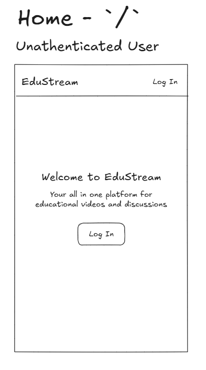

  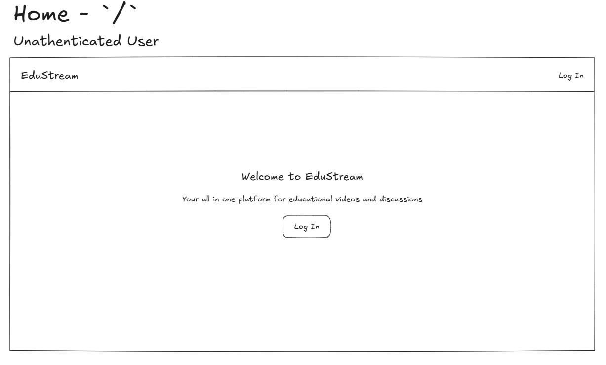

  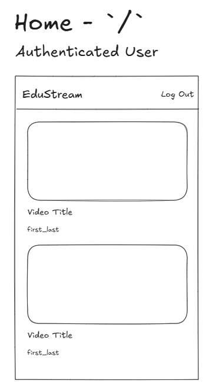

  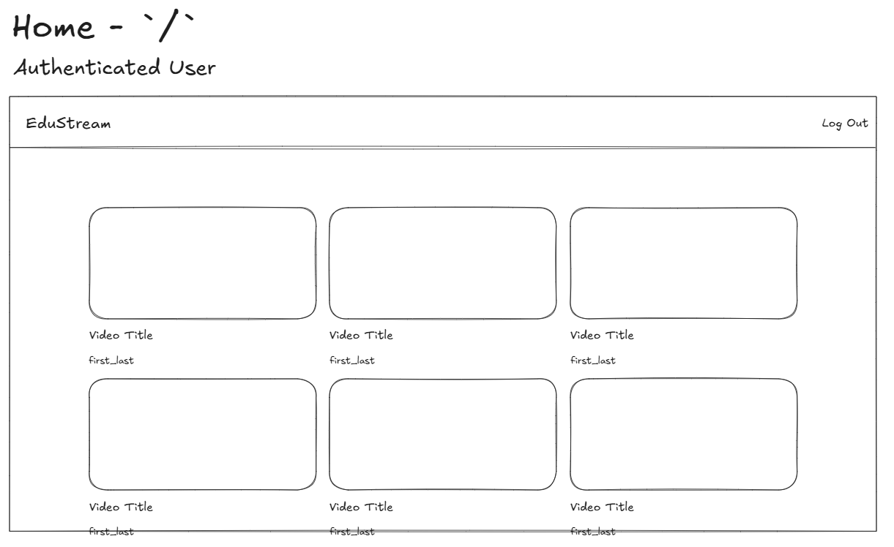

- **Video Detail Page** - `/video/[video-id]`

  - Video player UI with playback controls.
  - Inline video editing functionality.
  - Comment section with a form for new comments.

  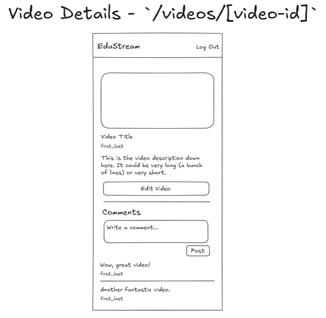

  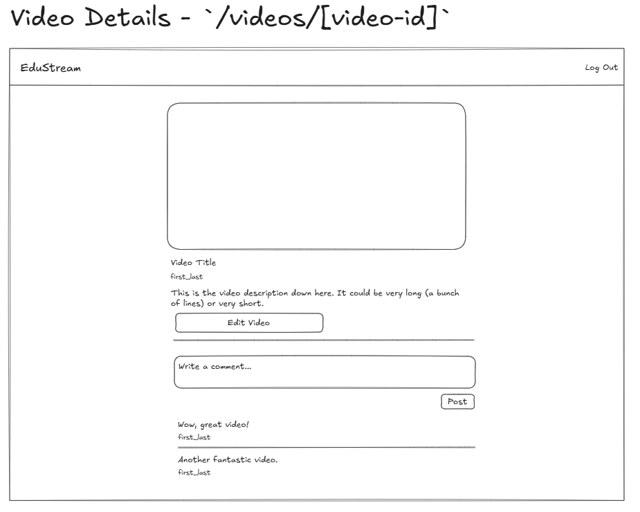

  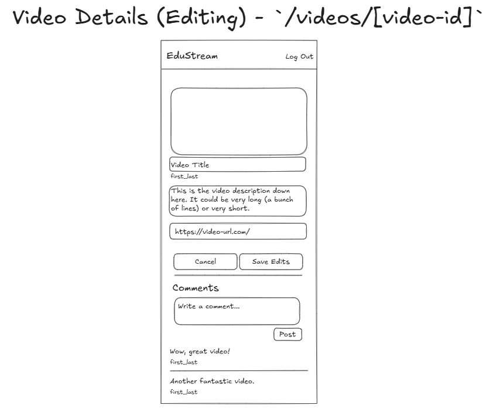

  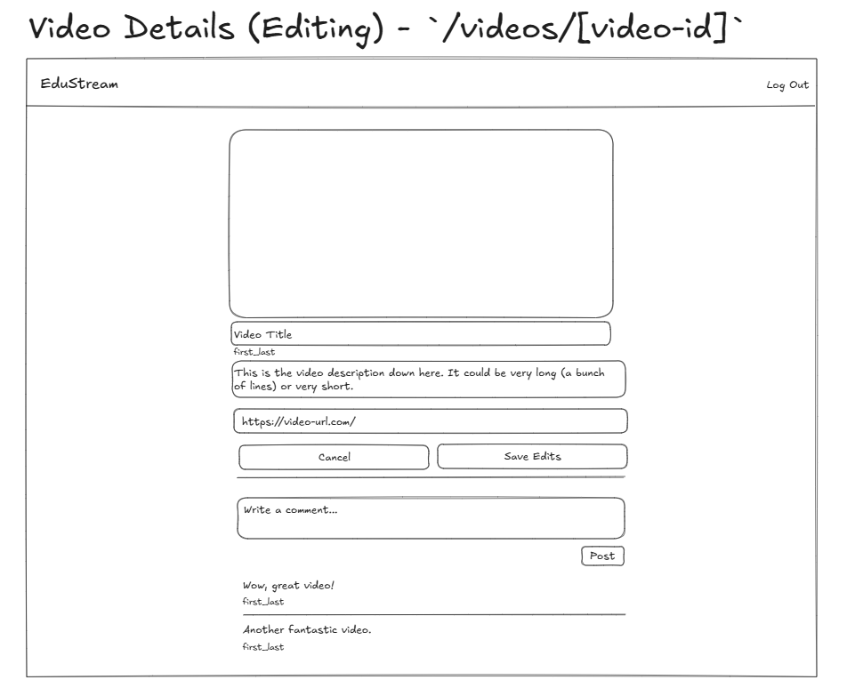

- **Upload Page** - `/upload`

  - Simple and intuitive form for video submissions.
  - Easier to manage than a modal, allows for separation of concerns and extensibility.

  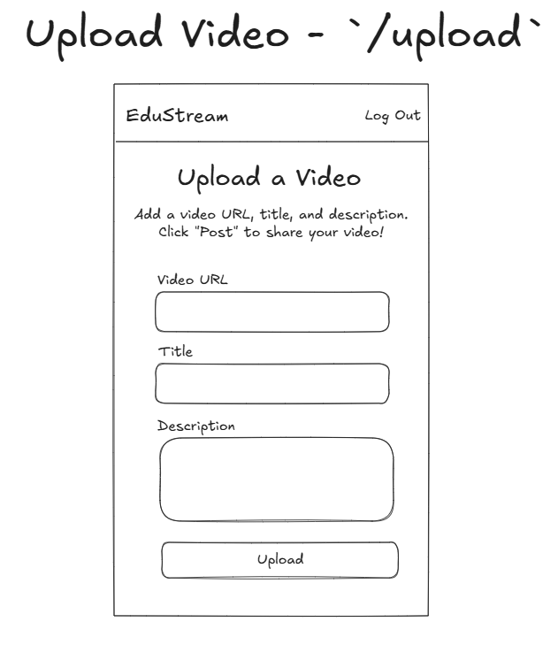

  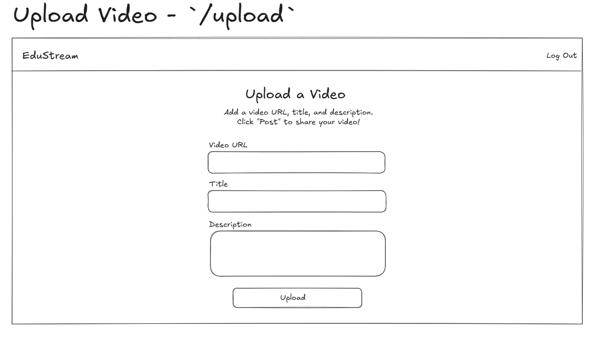

- **Login Page** - `/login`

  - Simple form allowing users to log in with first and last name.
  - First and last name required for successful login.

  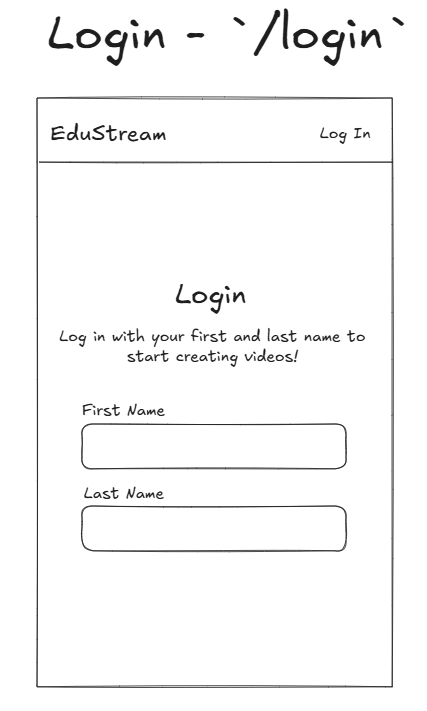

  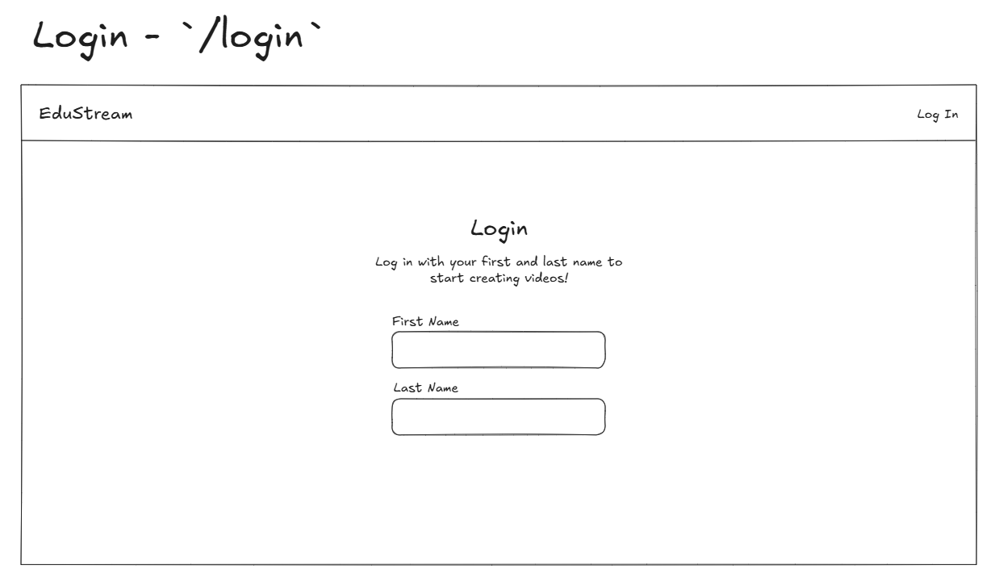

- **404 Page** - `/[any-invalid-url]`

  - Catch invalid URLs and provide CTA to navigate back to the home page.

  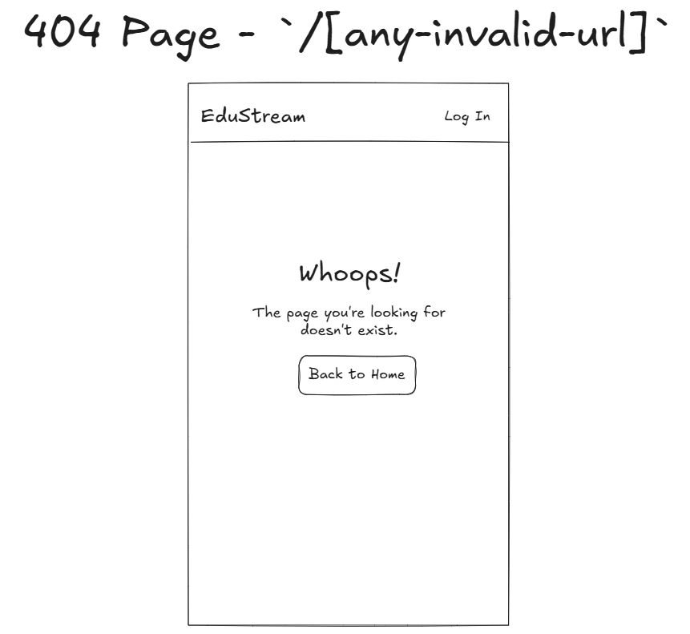

  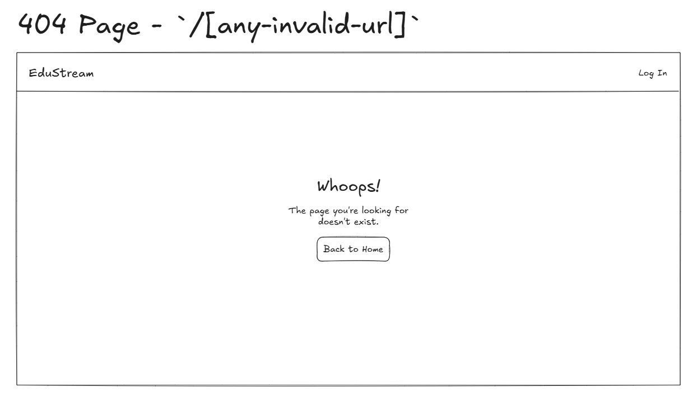

---

## Technology Stack & Justification

| Technology                                                     | Purpose                      | Justification                                                                                                                                                         | Limitations                           |
| -------------------------------------------------------------- | ---------------------------- | --------------------------------------------------------------------------------------------------------------------------------------------------------------------- | ------------------------------------- |
| **Next.js 15**                                                 | Frontend framework           | Hybrid rendering (SSR + CSR) for optimal performance                                                                                                                  |                                       |
| **MUI (Material UI)**                                          | UI component library         | Pre-built components to ensure a polished UI with accessibility features                                                                                              |                                       |
| **React Context**                                              | Client-side state management | Simplest option for managing the user's "authentication" state                                                                                                        |                                       |
| [**react-player**](https://www.npmjs.com/package/react-player) | Video playback & controls    | Flexible, lightweight, and responsive option for a robust video player with built-in controls                                                                         | No longer supports DailyMotion videos |
| [**obscenity**](https://www.npmjs.com/package/obscenity)       | Profanity filter             | Users should not be allowed to upload profane content, including video titles, descriptions, and comments to an educational platform potentially targeted at children |                                       |

---

## Development Plan & Next Steps

### 1. Setting Up the Project

- Initialize Next.js 15 with TypeScript.
- Configure MUI and global styling.
- Set up the project structure (pages, components, services).

### 2. Implementing Core Features

- **Simulated User Authentication**: Allow users to "log in" and store user ID in global state with React Context.
- **Protected Pages**: Only allow users to view videos if they are logged in.
- **Upload Form**: Handle new video submissions.
- **Video List**: Fetch videos and display them on the homepage.
- **Video Player**: Implement playback features with interactive controls.
- **Video Editing**: Allow users to edit their videos inline on the video details page.
- **Comments System**: Build a comment section with real-time updates.

### 3. Enhancements & Optimizations

- Optimize the UI for mobile responsiveness.
- Notifications for success/error of user actions.
  - Log in/log out
  - Video uploads
  - Video edits
  - Comments?
- Implement pagination or infinite scroll for video lists. (Not currently possible with API implementation)
- Improve video loading performance with lazy loading (if necessary).

### 4. Testing & Deployment

- Conduct user testing to refine the experience.
- Write a **README** with setup instructions, features, and screenshots.

---

## Limitations

- Users are limited to viewing and interacting with only the videos they have uploaded.
- The API does not support server-side authentication or authorization.
- DailyMotion videos will not play due to updates in their embedding protocols.

---

## Potential Feature Expansions

- Allow users to view all videos uploaded to the platform to introduce social interaction between users.
- Extend the backend API to allow users to authenticate with the server.
- Add `limit` and `offset` parameters to the `/videos` API endpoint for video fetching with pagination or infinite scrolling.

---

## Conclusion

This design journey is intended to be a living and breating blueprint for the application's development and may be amended or added to throughout the development process. By leveraging Next.js 15’s hybrid rendering, integrating MUI for a polished UI, and using real-time updates for comments, the project will provide a seamless and interactive user experience for students, content creators, and discussion participants.

---
